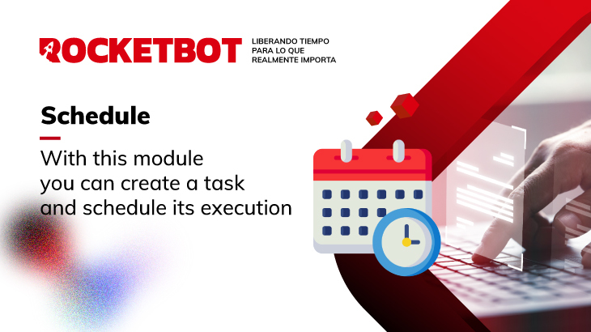

# Schedule
  
Con este módulo podrá crear una tarea y programar su ejecución  
  

## Como instalar este módulo
  
Para instalar el módulo en Rocketbot Studio, se puede hacer de dos formas:
1. Manual: __Descargar__ el archivo .zip y descomprimirlo en la carpeta modules. El nombre de la carpeta debe ser el mismo al del módulo y dentro debe tener los siguientes archivos y carpetas: \__init__.py, package.json, docs, example y libs. Si tiene abierta la aplicación, refresca el navegador para poder utilizar el nuevo modulo.
2. Automática: Al ingresar a Rocketbot Studio sobre el margen derecho encontrara la sección de **Addons**, seleccionar **Install Mods**, buscar el modulo deseado y presionar install.  

## Descripción de los comandos

### Programa una tarea
  
Crea una tarea .bat y programa su ejecución
|Parámetros|Descripción|ejemplo|
| --- | --- | --- |
|Nombre de la Tarea||Rocketbot kill app|
|Script para del .bat||taskkill /f /im rocketbot.exe|
|Argumentos|Argumentos para la creación de la tarea|/c 'exit'|
|Minutos|Tiempo para programar la ejecución tarea, debe ser un entero|10|
|Accion ID|ID para identificar de la tarea|Rocketbot killer|
|Descripción|Descripción de la tarea|Rocketbot killer batch file|
|Nivel de Privilegio|Index del Nivel de Privilegio para ejecutar la tarea.|0|
|Asignar a variable|Variable donde se guardará el resultado del comando|var|
