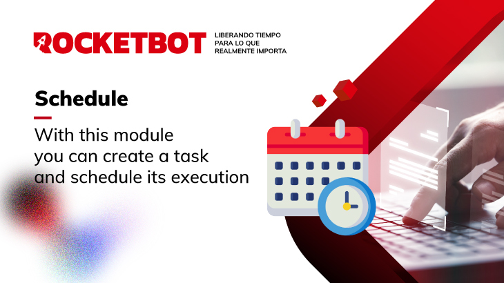

# Schedule
  
Com este módulo você pode criar uma tarefa e agendar sua execução  

## Como instalar este módulo
  
Para instalar o módulo no Rocketbot Studio, pode ser feito de duas formas:
1. Manual: __Baixe__ o arquivo .zip e descompacte-o na pasta módulos. O nome da pasta deve ser o mesmo do módulo e dentro dela devem ter os seguintes arquivos e pastas: \__init__.py, package.json, docs, example e libs. Se você tiver o aplicativo aberto, atualize seu navegador para poder usar o novo módulo.
2. Automático: Ao entrar no Rocketbot Studio na margem direita você encontrará a seção **Addons**, selecione **Install Mods**, procure o módulo desejado e aperte instalar.  

## Descrição do comando

### Agende uma tarefa
  
Crie uma tarefa .bat e agende sua execução
|Parâmetros|Descrição|exemplo|
| --- | --- | --- |
|Nome do tarefa||Rocketbot kill app|
|Script para o .bat||taskkill /f /im rocketbot.exe|
|Argumentos|Argumentos para criar a tarefa|/c 'exit'|
|Minutos|O horário para agendar a execução da tarefa deve ser um número inteiro|10|
|Ação ID|ID para identificar a tarefa|Rocketbot killer|
|Descrição|Descrição da tarefa|Rocketbot killer batch file|
|Nível de privilégio|Índice do Nível de Privilégio para executar a tarefa.|0|
|Atribuir à variável|Variável onde será salvo o resultado do comando|var|
